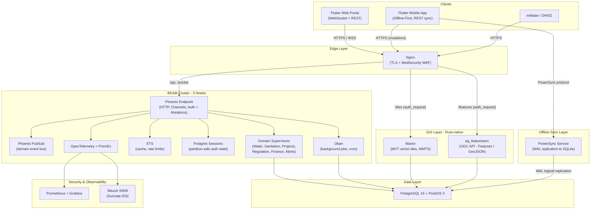
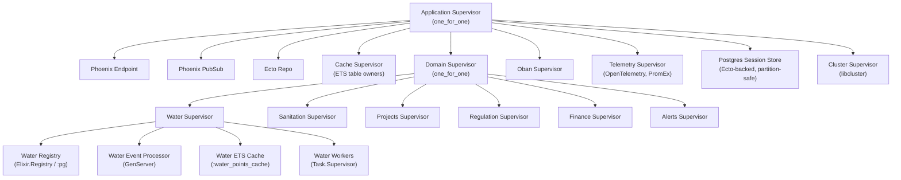
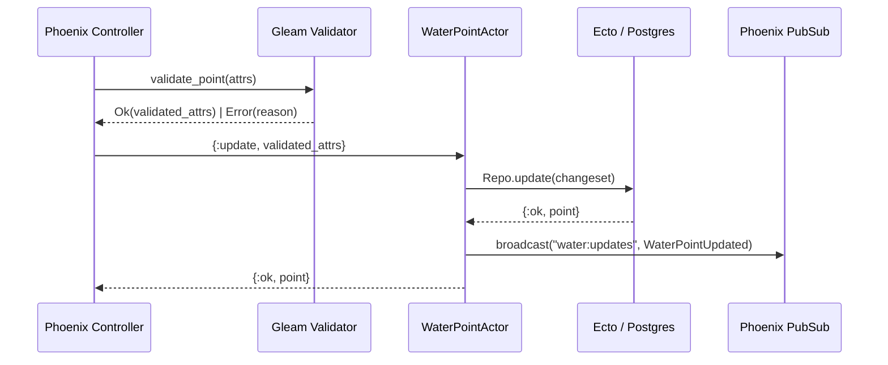
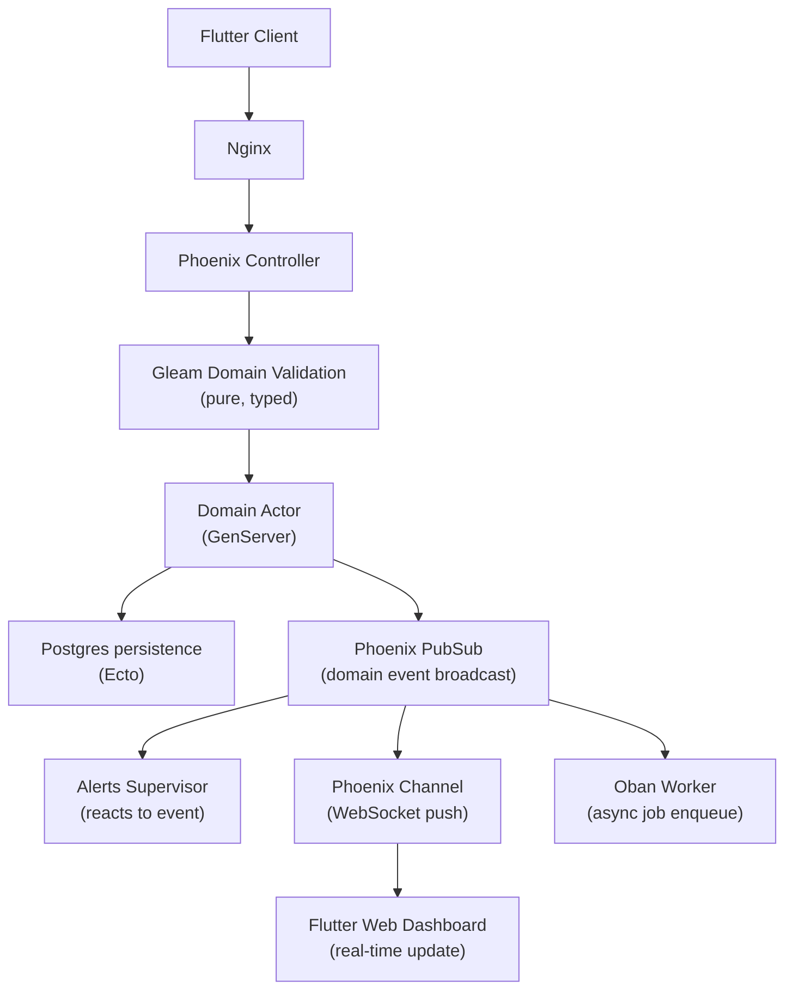

# SGI-EHA System Architecture Plan

## The Sovereign High-Availability Framework

This document consolidates the full SGI-EHA target architecture into a single technical plan. It combines the functional blueprint, the backend and runtime model, the GIS and offline-synchronization strategy, the infrastructure approach, and the operational rationale for adopting a BEAM-based modular architecture.

Rather than implementing a traditional microservices stack with Kubernetes, the system leverages BEAM’s native process isolation, supervision trees, and distributed node capabilities to achieve many of the same benefits—such as fault isolation, independent components, scalability, and clear service boundaries—within a unified runtime. This approach preserves the operational simplicity and performance of a modular monolith while maintaining the architectural advantages typically associated with microservices.

The goal is not just to describe software components, but to define an architecture that is realistic for the Democratic Republic of the Congo: bandwidth-constrained, sovereignty-aware, operationally lean, resilient under unstable connectivity, and maintainable by a small local platform team.

---

## 1. Executive Summary

SGI-EHA is designed as a national digital platform for the water, hygiene, sanitation, regulation, projects, finance, and alerting needs of the WASH sector. The system serves ministries, regulators, operators, provincial teams, field agents, and citizens through a unified web and mobile experience backed by a single coherent domain architecture.

The architecture is built on five core choices:

1. **Phoenix on the BEAM** for HTTP, WebSockets, authentication, supervision, and runtime resilience.
2. **Gleam** for strongly typed domain logic and validation, compiled to the same BEAM runtime.
3. **PostgreSQL 16 + PostGIS 3** as the authoritative source of truth for business data, geospatial data, sessions, jobs, and replication.
4. **Flutter** for the web portal and offline-first mobile application.
5. **Lightweight external infrastructure binaries** such as Martin, pg_featureserv, Nginx, and PowerSync, deployed simply and robustly without Kubernetes.

This produces a system that behaves like a disciplined microservice platform at the domain boundary level, while remaining operationally simple enough to deploy, monitor, and recover in real conditions.

---

## 2. Guiding Principles

### 2.1 Prefer BEAM primitives before adding external infrastructure

The default design rule is: use OTP processes, supervision trees, ETS, PubSub, and Oban before introducing external brokers, caches, schedulers, or workflow engines.

This means:

- No Redis unless a clear hard requirement emerges.
- No RabbitMQ for internal event propagation.
- No separate workflow engine for ordinary business orchestration.
- No Kubernetes introduced merely to supervise stateless binaries.

**Why this matters:** the BEAM already solves a large class of reliability and concurrency problems in-process. By using native BEAM capabilities first, the platform reduces operational complexity, lowers memory overhead, and keeps the failure surface smaller.

### 2.2 Bandwidth-aware by default

Every design choice is tested against a practical **128 kbps baseline**.

This principle drives the following decisions:

- Vector tiles instead of raster map images.
- PowerSync delta replication instead of bulk sync.
- WebSocket event pushes instead of polling.
- Short JSON payloads and selective loading on the frontend.
- Province-scoped subscriptions and role-scoped sync rules.

The system is not designed for perfect connectivity. It is designed to remain useful under poor connectivity.

### 2.3 Modular monolith over premature microservices

The backend is one OTP application with strict internal domain boundaries:

- Water
- Sanitation
- Projects
- Regulation
- Finance
- Alerts

Each domain has its own supervisor, registry, event processor, cache, actors, and API surfaces. This gives the team "virtual microservices" with strong separation, but without paying network, serialization, and orchestration penalties on every internal interaction.

If scale or team structure later justifies extraction, these domains can be separated into dedicated BEAM nodes or services with minimal conceptual change.

### 2.4 Gleam owns domain logic, Phoenix owns the runtime shell

Gleam provides:

- strict typing,
- safe data modeling,
- pure validation logic,
- domain algorithms with fewer invalid state possibilities.

Phoenix provides:

- routing,
- controllers,
- authentication flows,
- Channels,
- plugs,
- telemetry,
- runtime integration.

This split keeps business invariants explicit and reliable while leveraging Phoenix's proven ecosystem.

### 2.5 Partition tolerance over distributed in-memory state

The system explicitly avoids distributed in-memory session state such as Mnesia-based session replication for authentication and authorization.

Instead:

- sessions are stored in PostgreSQL,
- a short-lived ETS cache accelerates hot reads,
- every node reads from the same durable source of truth,
- session invalidation is visible cluster-wide.

This is a deliberate choice for unstable network conditions, where split-brain risks are more dangerous than a small read cost.

### 2.6 Sovereignty and survivability

The primary platform is hosted locally in the DRC to satisfy sovereignty requirements. Disaster recovery, encrypted offsite backups, and WAL replication provide continuity without moving operational control out of country.

---

## 3. Architectural Philosophy

### 3.1 Why the BEAM matters here

The BEAM was originally engineered for telecom-grade systems where uptime, concurrency, and fault isolation were non-negotiable. That heritage is directly relevant for SGI-EHA.

In practical terms, the BEAM gives the platform:

- lightweight concurrent processes,
- isolated failures,
- self-healing restart behavior,
- message-passing concurrency,
- high availability without bolting on many extra systems.

This is the origin of the "Nine Nines" inspiration. SGI-EHA is not claiming telecom-grade availability on day one, but it is adopting a runtime model descended from systems that were built to survive continuous real-world operation under heavy load.

### 3.2 Why not a heavy Kubernetes-first stack

Kubernetes is powerful, but it comes with a substantial operational tax:

- extra moving parts,
- higher RAM and CPU overhead,
- more complex networking,
- steeper troubleshooting burden,
- more YAML and more control plane dependencies.

For a system centered on a resilient OTP application and a few stateless side services, Kubernetes would solve fewer problems than it introduces.

The SGI-EHA strategy is therefore:

- use OTP for stateful domain resilience,
- use PostgreSQL for durability and coordination,
- use Nginx for edge routing and load balancing,
- use MAAS, MicroCloud, and LXD for infrastructure lifecycle and VM/container management,
- use native Linux service supervision for external binaries where appropriate.

This is a deliberate architecture, not a shortcut.

### 3.3 Native GIS efficiency over JVM-heavy middleware

Instead of GeoServer, the platform uses Martin and pg_featureserv.

This choice reduces:

- memory footprint,
- startup time,
- operational tuning overhead,
- serialization overhead for mobile/web mapping workloads.

It also aligns with the bandwidth-aware principle because vector tiles and direct GeoJSON outputs are materially more efficient for SGI-EHA's map-driven UI than large raster images and XML-heavy service layers.

---

## 4. High-Level System Architecture



### 4.1 Layer responsibilities

**Clients**

- Flutter web portal for dashboards, administration, analytics, and live operations.
- Flutter mobile app for field collection and offline-first workflows.
- External systems such as mWater and DHIS2 through controlled APIs and scheduled jobs.

**Edge**

- Nginx terminates TLS.
- ModSecurity provides WAF capability.
- `auth_request` protects GIS endpoints.
- Reverse proxy rules route traffic cleanly by path.

**BEAM application layer**

- Phoenix handles requests, channels, auth, and mutations.
- Gleam modules validate and model domain logic.
- OTP supervision isolates faults by domain.
- Oban manages background jobs.
- ETS provides local high-speed caching.

**Data and sync**

- PostgreSQL + PostGIS stores all durable data.
- PowerSync replicates relevant changes to mobile SQLite databases.

**GIS**

- Martin serves MVT vector tiles.
- pg_featureserv exposes feature query APIs returning GeoJSON.

**Security and observability**

- OpenTelemetry and PromEx expose metrics and traces.
- Prometheus and Grafana support monitoring.
- Wazuh and Suricata provide security visibility.

---

## 5. OTP Supervision Model

The backend runs as a single OTP application with isolated supervision boundaries. A process crash is treated as a normal recoverable event rather than a catastrophic failure.



### 5.1 Why this is important

A crash in a water domain worker does not take down sanitation, projects, sessions, Channels, or the endpoint. Each subsystem fails independently and restarts independently.

This creates:

- operational resilience,
- cleaner fault boundaries,
- simpler debugging,
- safer concurrency,
- fewer broad outages from narrow bugs.

---

## 6. Domain Actor Pattern

SGI-EHA models important business entities as OTP actors implemented with `GenServer`.

Example actor state:

`id, location, status, last_inspection`

### 6.1 Why actors are used

For certain write-heavy or coordination-sensitive entities, the actor pattern serializes updates naturally. This prevents race conditions that would otherwise require more locking, more retries, or more complex transactional choreography.

### 6.2 Example write flow



### 6.3 Actor hibernation strategy

Because the system may eventually reference very large numbers of entities, actors are not kept permanently resident in memory.

Lifecycle model:

1. An actor receives reads or writes and stays warm.
2. After an `idle_timeout`, it hibernates.
3. Memory is reclaimed.
4. On the next message, the actor is restarted and reloads state from PostgreSQL.

This preserves the developer and concurrency benefits of actors without letting memory usage grow linearly with record count.

---

## 7. Full Request Lifecycle



### 7.1 Interpretation

This flow expresses the core pattern of the platform:

- validate first,
- persist safely,
- emit domain events,
- react asynchronously where useful,
- push real-time updates when needed.

This produces a clean separation between critical-path writes and secondary side effects such as notifications, reporting, or synchronization.

---

## 8. Backend Subsystem Strategies

### 8.1 ETS caching strategy

ETS is used as a local in-memory accelerator, not as the source of truth.

| ETS Table | Contents | Access Pattern |
| --- | --- | --- |
| `:water_points_cache` | Hot water point records | read -> ETS miss -> Postgres, write-through |
| `:dashboard_metrics` | Aggregated BI counters | refreshed by Oban cron |
| `:rate_limit_counters` | Per-IP or per-user token buckets | ETS-backed rate limiter |
| `:gis_layer_metadata` | ISO 19115 metadata records | refreshed on write |

**Why ETS fits here:** reads are extremely fast, local, and cheap. Because data durability lives in PostgreSQL, ETS can be treated as a safe performance layer.

### 8.2 Phoenix PubSub topics

| Topic | Published by | Subscribed by |
| --- | --- | --- |
| `water:updates` | WaterPointActor | Alerts, analytics, Channel broadcaster |
| `water:province:<id>` | WaterPointActor | Province-scoped Flutter Channel |
| `alerts:new` | Alerts Supervisor | Notification worker, Channel |
| `projects:status_change` | Projects Actor | Finance, regulation, Channel |

PubSub is the in-process event backbone for live dashboards, alert propagation, and internal event-driven reactions.

### 8.3 Session management: PostgreSQL over Mnesia

Sessions are stored in a `user_sessions` table containing fields such as:

- `token`
- `user_id`
- `roles`
- `expires_at`
- `last_seen_at`

The logic is straightforward:

- authenticate once,
- persist session centrally,
- cache hot reads briefly in ETS,
- revoke or rotate centrally,
- avoid distributed-memory divergence.

This is safer for unreliable links and simpler for auditability and RBAC consistency.

### 8.4 Oban background jobs

All asynchronous work is handled through Oban and PostgreSQL.

| Worker | Trigger | Responsibility |
| --- | --- | --- |
| `MWaterSyncWorker` | Hourly cron | Pull infrastructure data, normalize through Gleam, upsert, emit events |
| `Dhis2SyncWorker` | Daily cron | Bidirectional health-related sync |
| `ReportGeneratorWorker` | Nightly cron | Build SDG and national indicators |
| `AlertNotifierWorker` | On `alerts:new` | Fan-out alert notifications |
| `MobileUploadWorker` | Batch endpoint | Process offline-collected mobile records |

Oban is chosen because it uses the same durability substrate as the rest of the system, which keeps operations and recovery simple.

---

## 9. GIS Architecture

### 9.1 Martin and pg_featureserv instead of GeoServer

The GIS stack is based on two small, stateless services:

| Service | Protocol | Output | Benefit |
| --- | --- | --- | --- |
| Martin | WMTS / XYZ | Mapbox Vector Tiles | Significantly smaller payloads than raster WMS |
| pg_featureserv | OGC API - Features | GeoJSON | Clean feature access for app clients |

### 9.2 Why this is strategically better

This approach avoids JVM-heavy middleware and aligns with the actual needs of SGI-EHA:

- the client needs vector tiles and features,
- the database is already PostGIS,
- the services are stateless,
- Nginx can gate and balance them,
- the team avoids a large additional GIS middleware tier.

### 9.3 DRC-specific advantages

- Lower RAM footprint leaves more resources for PostgreSQL and BEAM nodes.
- Smaller map payloads improve usability on poor mobile networks.
- GeoJSON integrates naturally with Flutter clients.
- Vector rendering can happen on the client, reducing server-side rendering cost.

### 9.4 Access control model

Martin and pg_featureserv do not implement the application's RBAC semantics themselves. Access control is enforced at the edge:

- user authenticates with Phoenix,
- Nginx forwards a subrequest via `auth_request`,
- Phoenix validates JWT and role,
- Nginx allows or denies the GIS request,
- the GIS service remains stateless and simple.

### 9.5 Metadata handling

ISO 19115 metadata is stored in PostgreSQL as JSONB and exposed through a dedicated Phoenix controller, rather than through a GIS catalog server.

This keeps metadata governed within the same app-level security and domain model.

---

## 10. Frontend Architecture

### 10.1 Flutter web portal

The web portal is designed for provincial and national stakeholders who need a fast, responsive, map-driven interface.

Key frontend choices:

- `Riverpod` with `AsyncNotifier` for state management.
- `dio` with token refresh support.
- Phoenix Channels for live updates.
- `go_router` with deferred loading for fast first paint.
- `flutter_map` with `VectorTileLayer` for Martin-served MVT tiles.
- `fl_chart` for dashboards and BI views.

### 10.2 Flutter mobile app

The mobile app is fundamentally offline-first. Field agents must be able to continue working with unreliable or absent connectivity.

Core pattern:

`Postgres WAL -> PowerSync -> device SQLite -> Drift watchers -> Riverpod UI`

This means:

- devices keep a local working dataset,
- replication resumes from the last acknowledged change,
- only deltas move over the network,
- the UI reacts to local database changes,
- the user is not blocked by unstable connectivity.

### 10.3 Shared Flutter package

The shared package centralizes:

- generated API clients,
- DTOs,
- common models,
- theme and design tokens,
- reusable UI conventions.

This reduces duplication and keeps web/mobile behavior aligned.

---

## 11. Monorepo Structure

```text
sgi-eha/
├── backend/
│   ├── apps/
│   │   ├── sgi_eha/
│   │   │   ├── lib/
│   │   │   │   ├── sgi_eha/
│   │   │   │   │   ├── application.ex
│   │   │   │   │   ├── domain_supervisor.ex
│   │   │   │   │   ├── water/
│   │   │   │   │   │   ├── supervisor.ex
│   │   │   │   │   │   ├── registry.ex
│   │   │   │   │   │   ├── event_processor.ex
│   │   │   │   │   │   ├── cache.ex
│   │   │   │   │   │   └── water_point_actor.ex
│   │   │   │   │   ├── sanitation/ ...
│   │   │   │   │   ├── projects/ ...
│   │   │   │   │   ├── regulation/ ...
│   │   │   │   │   ├── finance/ ...
│   │   │   │   │   └── alerts/ ...
│   │   │   │   └── sgi_eha_web/
│   │   │   │       ├── router.ex
│   │   │   │       ├── channels/
│   │   │   │       └── controllers/
│   │   └── sgi_eha_jobs/
│   ├── gleam/
│   │   ├── gleam.toml
│   │   └── src/
│   │       ├── water/
│   │       ├── sanitation/
│   │       ├── projects/
│   │       ├── regulation/
│   │       ├── finance/
│   │       └── alerts/
│   └── priv/
│       └── repo/migrations/
├── frontend/
│   ├── shared/
│   ├── web/
│   └── mobile/
└── infra/
    ├── nginx/
    ├── martin/
    ├── pg_featureserv/
    ├── powersync/
    └── compose.yml
```

### 11.1 Why a monorepo is appropriate

A monorepo keeps the platform coherent during the formative years:

- shared contracts are easier to maintain,
- frontend and backend can evolve together,
- infra config remains versioned with app changes,
- domain boundaries remain visible without requiring repo fragmentation.

This is especially valuable where staffing is compact and architecture clarity matters more than repository purity.

---

## 12. Technology Reference

| Concern | Tool |
| --- | --- |
| HTTP / WebSockets | Phoenix |
| Business logic / validation | Gleam modules |
| DB access | Ecto, optional `gleam_pgo` for Gleam-side reads |
| Background jobs | Oban |
| In-process cache | ETS |
| Session state | PostgreSQL `user_sessions` + ETS read-through |
| Actor lifecycle | `GenServer` hibernation and Registry-based restart |
| Rate limiting | Hammer-style ETS token bucket |
| Auth / MFA | `phx_gen_auth` + TOTP + JWT |
| RBAC | PostgreSQL role and permission tables enforced in Phoenix plugs |
| Node clustering | `libcluster` |
| GIS vector tiles | Martin |
| GIS feature queries | pg_featureserv |
| Mobile offline sync | PowerSync |
| Telemetry | OpenTelemetry + PromEx + Prometheus + Grafana |
| Security | Nginx, ModSecurity, Suricata, Wazuh |
| Backup / DR | `pgBackRest` and encrypted snapshots |

---

## 13. Infrastructure and Deployment Model

### 13.1 Core infrastructure components

The production stack consists of:

- Nginx
- PostgreSQL 16 + PostGIS 3
- BEAM cluster with Phoenix, Oban, ETS, PubSub, domain supervisors
- Martin
- pg_featureserv
- PowerSync
- Prometheus and Grafana
- Wazuh and Suricata

### 13.2 Ubuntu MAAS, MicroCloud, and LXD fit

Because the target environment uses **Ubuntu MAAS**, **MicroCloud**, and **LXD**, SGI-EHA can be deployed in a clean infrastructure pattern without Kubernetes.

**MAAS** provides:

- bare-metal provisioning,
- machine inventory,
- network and power control,
- repeatable node deployment.

**MicroCloud** provides:

- a lightweight cloud control plane for the local environment,
- clustered infrastructure services,
- a practical foundation for running application workloads across multiple hosts.

**LXD** provides:

- efficient system containers and virtual machines,
- simple image-based deployment,
- lower overhead than a Kubernetes cluster,
- strong isolation for stateless services and app nodes.

### 13.3 Recommended deployment layout

An example production topology:

- 3 LXD instances for the BEAM application nodes
- 1 to 2 PostgreSQL/PostGIS instances depending on HA strategy
- 1 LXD instance for Nginx
- 1 or more LXD instances for Martin and pg_featureserv
- 1 LXD instance for PowerSync
- 1 observability/security segment for Prometheus, Grafana, Wazuh, and related tooling

This can be spread across multiple MAAS-managed physical hosts with MicroCloud coordinating the local cloud layer.

### 13.4 Why Kubernetes is still unnecessary

Martin and pg_featureserv are stateless binaries:

- request comes in,
- SQL runs,
- response goes out,
- no durable in-memory state is carried across requests.

That means their lifecycle does not need pod orchestration, service mesh behavior, or cluster-level scheduling complexity. They simply need:

- a place to run,
- a restart policy,
- network exposure behind Nginx,
- horizontal duplication if load increases.

With MAAS, MicroCloud, and LXD already in the stack, that requirement is already satisfied.

### 13.5 How Martin and pg_featureserv are supervised

There are two sensible deployment modes:

**Option A: systemd inside a VM or system container**

- install the binary,
- define a `systemd` unit,
- set `Restart=always`,
- expose the service on an internal port.

**Option B: containerized runtime in LXD**

- package the service in a container image or managed instance,
- configure restart behavior at the host or container level,
- attach to the internal network,
- keep Nginx as the stable public entrypoint.

Both are operationally lighter than introducing Kubernetes solely for process supervision.

### 13.6 Horizontal scaling model

If Martin or pg_featureserv needs more throughput:

- run another instance,
- place it on another LXD instance or another host,
- add it to an Nginx upstream block,
- let Nginx round-robin traffic.

The scaling model is deliberately boring, which is exactly what production infrastructure should be.

### 13.7 Infrastructure boundary

The architecture has a clean boundary:

**Stateful domain logic**

- supervised by OTP,
- clustered via the BEAM,
- governed by domain processes and durable Postgres state.

**Stateless infrastructure services**

- kept alive by Linux and LXD-level process management,
- load-balanced by Nginx,
- scaled horizontally without orchestration sprawl.

This split is central to the whole SGI-EHA architecture.

---

## 14. Security, Compliance, and Sovereignty

### 14.1 Security posture

Security is layered rather than delegated to a single tool.

- Nginx terminates TLS.
- ModSecurity provides WAF protections.
- Phoenix enforces application authentication and authorization.
- MFA is mandatory for privileged roles.
- JWT and server-side session controls work together.
- Suricata and Wazuh improve detection and investigation capability.

### 14.2 RBAC and auditability

Permissions are modeled in PostgreSQL and enforced in Phoenix plugs and domain actions. This provides a durable, inspectable, auditable authorization model.

### 14.3 Data sovereignty

Primary hosting remains in the DRC. This satisfies legal and policy requirements around national data control while still allowing encrypted offsite DR replication.

### 14.4 Disaster recovery

The disaster recovery strategy includes:

- WAL streaming to an external replica,
- nightly encrypted backups,
- cold storage snapshots,
- restore testing as an operational requirement, not just a checkbox.

---

## 15. Performance Targets and How the Architecture Meets Them

| Target | Strategy |
| --- | --- |
| `<= 800 ms` API response | ETS for hot reads, efficient Postgres access, short session TTL caching, lightweight runtime concurrency |
| `<= 1.2 s` web module load | Flutter deferred loading and route-level lazy loading |
| 500 concurrent users | BEAM process model, Phoenix Channels, shared-nothing concurrency, clustered nodes |
| 99.5% monthly availability | OTP supervision, Nginx health checks, 3-node BEAM cluster, central durable session store |
| 128 kbps tolerance | MVT tiles, delta sync, offline SQLite, WebSocket diffs, reduced payload design |

### 15.1 A note on realism

These targets are credible because the architecture is intentionally aligned with them. They are not wishful metrics pasted onto an unrelated stack.

Every major platform decision maps back to one or more of these targets.

---

## 16. Implementation Phases

### Phase 1: Foundation

- scaffold the monorepo,
- establish the Phoenix umbrella,
- define the OTP supervision tree,
- create the Gleam domain library,
- provision PostgreSQL + PostGIS,
- implement the session store,
- stand up Nginx and base infrastructure.

### Phase 2: Core domain modules

- implement Water, Sanitation, Projects, Regulation, and Finance,
- define schemas and migrations,
- build actors, caches, registries, and controllers,
- encode validation in Gleam.

### Phase 3: Real-time eventing

- implement domain events,
- configure Phoenix PubSub and Channels,
- connect Flutter web dashboards to live updates.

### Phase 4: Background jobs and integrations

- implement Oban workers,
- integrate mWater and DHIS2,
- add reporting and alert fan-out workflows.

### Phase 5: GIS

- deploy Martin and pg_featureserv,
- structure PostGIS layers,
- configure Nginx `auth_request`,
- expose metadata and feature services.

### Phase 6: Offline sync

- deploy PowerSync,
- configure WAL logical replication,
- define Sync Rules,
- wire the mobile app to local SQLite and reactive watchers.

### Phase 7: Web portal

- complete auth, MFA, dashboards, admin views, analytics, GIS UI, and RBAC management.

### Phase 8: Mobile app

- complete offline forms,
- local persistence,
- background synchronization,
- offline map tile caching,
- field workflows.

### Phase 9: Security and observability

- implement metrics, traces, dashboards, SIEM hooks, WAF hardening, and operational alerting.

### Phase 10: Production hardening

- deploy on MAAS/MicroCloud/LXD,
- validate clustering,
- finalize backups and restore runbooks,
- execute load testing,
- verify performance and availability objectives.

---

## 17. Operational Recommendations

To keep the system maintainable in practice, the following operational habits are recommended from the beginning:

- keep infrastructure diagrams versioned with code,
- treat backup restore testing as mandatory,
- instrument every domain early rather than later,
- keep sync rules and RBAC matrices explicitly documented,
- standardize Nginx path conventions for all externally exposed services,
- maintain a clear ownership model per domain module.

These are small disciplines that prevent large future confusion.

---

## 18. Strategic Conclusion

SGI-EHA is not merely a software stack. It is an architecture intentionally shaped around the realities of public-sector digital infrastructure in the DRC.

It combines:

- the resilience and concurrency strengths of the BEAM,
- the correctness benefits of Gleam,
- the maturity of Phoenix,
- the efficiency of Flutter,
- the geospatial power of PostGIS with lightweight GIS services,
- the practicality of PowerSync for offline mobile work,
- and an infrastructure model that remains operable without Kubernetes.

Most importantly, it respects the actual environment in which it must succeed:

- limited bandwidth,
- uneven connectivity,
- strict sovereignty needs,
- operational staffing constraints,
- and the need for a system that keeps working even when conditions are not ideal.

That is why this architecture is coherent. Every major decision supports the others. It is not a collection of fashionable tools. It is a deliberate sovereign high-availability framework for national WASH operations.
